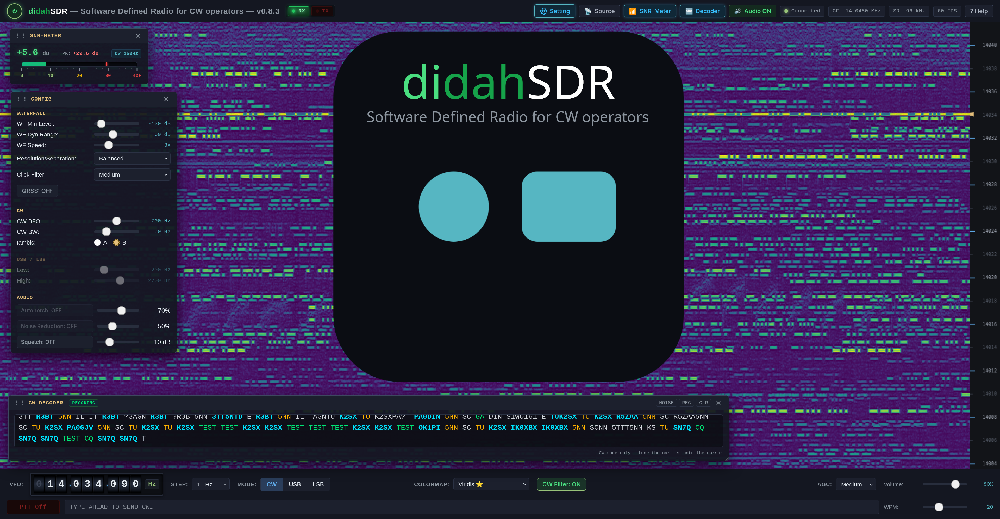

# didahSDR



didahSDR is a web SDR for Morse (CW) operators. The browser does all the signal processing: FFT,
waterfall, CW/USB/LSB demodulation, AGC, noise reduction, an S-meter and a neural CW decoder. The
waterfall scrolls right to left with frequency on the vertical axis, so a CW signal reads like text.

The client is plain HTML/CSS/JavaScript with no framework and no build step. The optional Python server
only streams a recorded IQ file; it does no DSP.

## Sources

| Source | What it is |
| --- | --- |
| Replay | The Python server loops a 16-bit stereo IQ WAV over a WebSocket |
| KiwiSDR | Direct SND connection to a public KiwiSDR, IQ mode, about 12 kHz wide |
| Sound card | Stereo I/Q (SoftRock style) at 48 / 96 / 192 kHz, centre 0 Hz |
| IC-7300 | The radio's 12 kHz USB IF, mixed to complex baseband; CI-V (Web Serial) for the VFO and CW keying |
| RTL-SDR | RTL2832U + R820T/R820T2 over WebUSB, decimated to 192 kHz; direct sampling for HF |

The browser needs WebGL and AudioWorklet. The sound card and IC-7300 sources need a secure context
(`https://` or `localhost`). Web Serial and WebUSB are Chromium-only (Chrome, Edge).

## Quick start

```bash
git clone https://github.com/Guenael/didahSDR.git
cd didahSDR
python3 -m venv .venv && source .venv/bin/activate
pip install -e ".[dev]"
python3 server/replay_server.py --wav /path/to/recording.wav --center-freq 14048000
```

Open <http://localhost:9000> and press **Power** (the browser needs a click before it plays audio).
The Kiwi, sound-card, IC-7300 and RTL-SDR sources work without a recording: pick them in the **Source**
window.

### IQ recordings

No recording is shipped with the repository. The replay source needs a **16-bit stereo PCM WAV** with I on
the left channel and Q on the right, at any sample rate (96 or 192 kHz is typical). This is what HDSDR,
SDR# and most SDR programs write when they record the raw IQ baseband (`WAVE_FORMAT_EXTENSIBLE` headers
are fine). Pass the recording's centre frequency with `--center-freq`: IQ files do not store it (HDSDR
puts it in the file name, e.g. `HDSDR_20120219_174346Z_14048kHz_RF.wav`).

```bash
python3 server/replay_server.py --wav samples/my_recording.wav --center-freq 7048000 --port 9000
```

| Argument | Default | Description |
| --- | --- | --- |
| `--wav` | `./samples/SAMPLE_20120219_174346Z_14048kHz_RF.wav` if present | 16-bit stereo IQ WAV, looped |
| `--center-freq` | `14048000` | Centre frequency of the recording, Hz |
| `--host` | `0.0.0.0` | Bind address |
| `--port` | `9000` | HTTP and WebSocket port |

### CW decoder assets

The decoder runs a small ONNX model with onnxruntime-web in a worker. Neither is in git:

- **onnxruntime-web**: `scripts/fetch_ort.sh` downloads the pinned version from the npm registry, checks
  its sha512, and installs it in `app/lib/`. The container build does this for you.
- **The model**: `app/models/didahcw.onnx` and `didahcw.onnx.json`, exported by the training repository
  (`didahSDR-cw-training-model`, `python -m didahcw.export … --out app/models/didahcw`).

Without them everything else works, and the decoder window shows **NO MODEL** with the reason.

## Container

```bash
podman build -t didahsdr .
podman run --rm -p 9000:9000 -v ./samples:/home/app/samples:ro,Z localhost/didahsdr \
    --wav /home/app/samples/my_recording.wav --center-freq 14048000
```

Arguments after the image name go to the server. The image runs as an unprivileged user and includes
onnxruntime-web; `app/models/` is copied in when it exists in the build context. Docker works the same way.

## Using it

Mouse, on the waterfall:

| Action | Effect |
| --- | --- |
| Click, or click and drag | Tune to that frequency |
| Wheel | Step the VFO by the selected step |
| Ctrl + wheel, Ctrl + drag | Zoom, centred on the cursor |
| Shift + wheel, Shift + drag, drag on the ruler | Pan (Kiwi and RTL-SDR retune their centre; the IC-7300 retunes its VFO) |
| Ctrl + Shift + wheel or drag | CW bandwidth, or the SSB high edge |

Keyboard:

| Key | Effect |
| --- | --- |
| Space | Power on/off |
| M | Cycle CW → USB → LSB |
| ↑ / ↓ | Step the VFO |
| ← / → , Home / End | Zoom out / in, zoom min / max |
| + / − | Change the tuning step (10 Hz to 5 kHz) |
| Enter | Arm/disarm PTT (CW) |
| F8 / F9 / F4 | Dit paddle / dah paddle (iambic A or B) / straight key |
| Esc | Close the help |

The frequency drum takes the wheel on each digit, digit typing after a click, and right click to zero
the digits to its right. Settings (levels, colormap, filters, source options) are kept in the browser's
local storage. Window positions are kept too. The **? Help** button opens the full guide.

Main controls: Min level (−140 to −20 dB) and dynamic range (20 to 120 dB); waterfall speed 1–8×; FFT
1024 / 2048 / 4096; CW filter (adaptive noise floor plus a click-sharpening kernel) for the waterfall;
QRSS view; CW bandwidth 50–500 Hz and pitch 400–1000 Hz; SSB passband 50–4000 Hz; AGC fast/medium/slow;
autonotch, noise reduction, squelch; CW keyer 10–40 WPM.

### Transmit (CW)

F8/F9/F4 and the text box key a local sidetone. With the IC-7300 source and CI-V connected, the same
keyer drives the radio: DTR is the CW key and RTS is PTT (swappable), and typed text can go out through
the radio's own keyer (CI-V `0x17`). Losing window focus releases the key and disarms PTT, and a key held
down for more than 10 s is released automatically.

### Recording decoder clips

**REC** in the decoder window saves the decoder input with a sidecar, for labelling and model evaluation.
See [docs/recording.md](docs/recording.md).

## Architecture

```
Browser (vanilla JS, WebGL, Web Audio, Workers)
│
├── IQ source → onRawIQ(Float32 interleaved ±1)          (only the selected source)
│    ├── audio: NCO → halfbands → ~12 kHz → Kaiser channel filter → BFO → [notch/NR] → AGC → AudioWorklet
│    │            └── tap after the channel filter → CW decoder worker (front end + stateless ONNX call)
│    └── video: ring → window → FFT → dB → [CW filter] → WebGL waterfall, S-meter
│
▼ WebSocket /ws: text handshake + config JSON, then 0x03 + int16 interleaved IQ every 25 ms
Python server (aiohttp, standard library only otherwise)
└── WavIQLooper: any-size WAV, looped with a bounded (~16 MB) threaded read-ahead
```

- Demodulation runs at one channel rate near 12 kHz (`demodulator.js`), so the selectivity does not
  depend on the source rate. USB/LSB passbands are in `modes.js`.
- The client scripts are plain `<script>` globals; load order is in `app/index.html`. `app.js` only
  wires the controllers (`spectrum_pipeline.js`, `tuning.js`, `source_manager.js`, `tx_controller.js`,
  `ic7300_controller.js`, `ui_bindings.js`, `prefs_store.js`). Hot paths (`processRawIQ`, FFT, audio
  callback, render loop) do not allocate.
- The CW decoder front end (`cw_frontend.js`) must stay numerically identical to the training repo's
  `didahcw/frontend.py`; `tests/js/cw_frontend.test.js` checks it against a fixture generated there.
- Performance: `node scripts/bench.js` prints the CPU cost of the hot paths. They all stay within a few
  percent of one core, which is why the DSP is plain JavaScript and not WebAssembly.

The server's `/ws` protocol follows the OpenWebRX handshake (`SERVER DE CLIENT` / `CLIENT DE SERVER`). The
client also sends `dspcontrol` JSON for a future live backend; the replay server ignores it.

## Development

```bash
source .venv/bin/activate
pytest                                   # server tests (synthetic WAVs, no recording needed)
ruff check server tests && black -l 120 --check server tests

npm ci                                   # dev tooling only: app/ has no npm dependencies
npm run lint                             # ESLint
node --test tests/js/                    # client DSP, sources, keyer, decoder tests
node scripts/bench.js                    # hot-path CPU cost
```

Client changes need only a browser refresh. Add `?audiodebug` to the URL for a per-second console line of
audio pipeline counters (underruns and overflows are cumulative since the page loaded).

CI (`.github/workflows/ci.yml`) runs the Python checks on 3.10, 3.12 and 3.13, ESLint and the Node tests,
and builds the container and smoke-tests it with a synthetic recording.

Colormaps in `app/js/colormaps.js` are generated by `scripts/convert_palette.py`.

## Repository layout

```
app/                 client (served statically)
  index.html         page and script load order
  js/                DSP, sources, UI, decoder worker, audio worklets
  css/
  lib/, models/      CW decoder assets (not in git, see above)
server/              replay_server.py
tests/               pytest (server) and tests/js (node --test)
scripts/             fetch_ort.sh, convert_palette.py, bench.js
docs/                recording.md, decoder-roadmap.md
```

## Roadmap

- CW decoder: see [docs/decoder-roadmap.md](docs/decoder-roadmap.md).
- IQ amplitude/phase imbalance correction for sound-card IQ.
- Mono sound-card source (a transceiver's audio output, about 4 kHz wide).
- Touch support for the waterfall.

## Author

- **Guenael** - *Initial Concept & DSP Algorithms*

## License

didahSDR is free software: you can redistribute it and/or modify it under the terms of the GNU Affero
General Public License as published by the Free Software Foundation, either version 3 of the License, or
(at your option) any later version. See [LICENSE](LICENSE).
